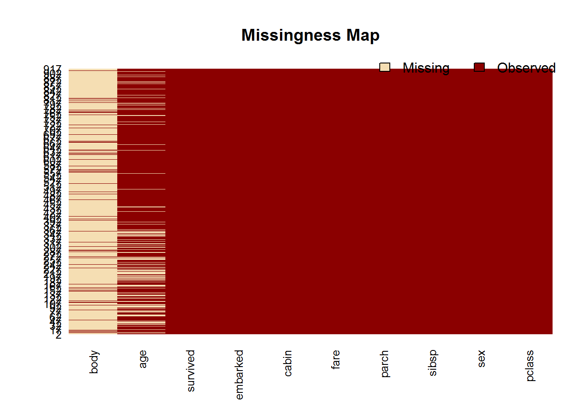
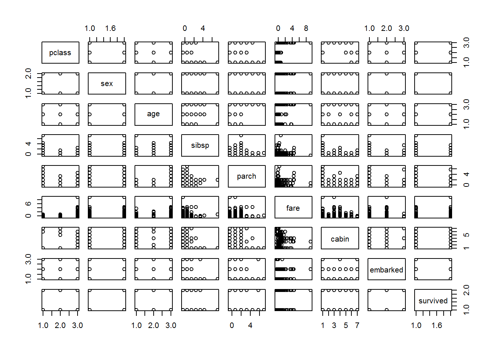
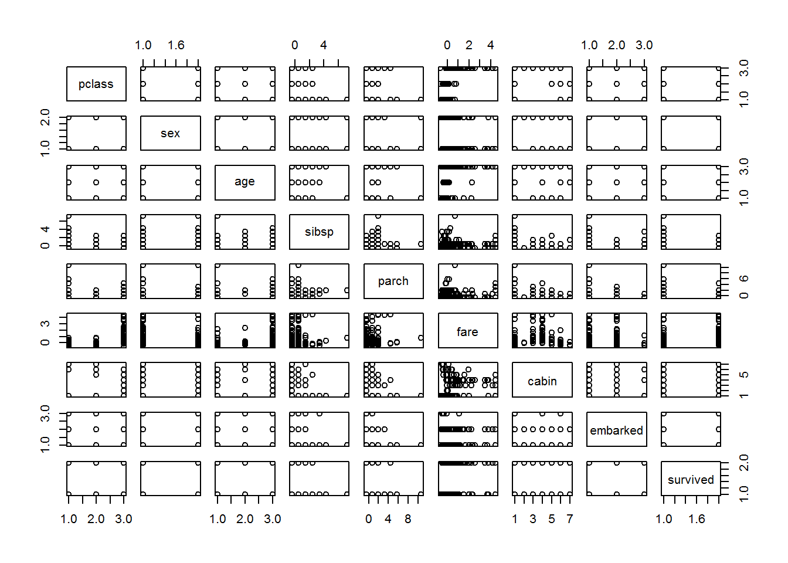

We're working with data on who survived the Titanic. 

## Source
We're collecting our data from a SQLite database. The titanic3 data was originally pulled in from the PASWR package and is the third major version of that dataset. It contains more features than the basic titanic dataset available in the datasets package.


```r
library(DBI)
library(RSQLite)
titanicdb<-dbConnect(SQLite(),dbname="../data-raw/titanic.sqlite")
```

## Data
We're using just a single table of data that has already been collated. Here is a quick overview of the data.


```r
titanic_all<-dbReadTable(titanicdb, "titanic")
knitr::kable(head(titanic_all))
```


pclass    survived  name                              sex           age   sibsp   parch  ticket        fare  cabin     embarked      boat    body  home.dest                       
-------  ---------  --------------------------------  -------  --------  ------  ------  -------  ---------  --------  ------------  -----  -----  --------------------------------
1st              1  Allen, Miss. Elisabeth Walton     female    29.0000       0       0  24160     211.3375  B5        Southampton   2         NA  St Louis, MO                    
1st              1  Allison, Master. Hudson Trevor    male       0.9167       1       2  113781    151.5500  C22 C26   Southampton   11        NA  Montreal, PQ / Chesterville, ON 
1st              0  Allison, Miss. Helen Loraine      female     2.0000       1       2  113781    151.5500  C22 C26   Southampton             NA  Montreal, PQ / Chesterville, ON 
1st              0  Allison, Mr. Hudson Joshua Crei   male      30.0000       1       2  113781    151.5500  C22 C26   Southampton            135  Montreal, PQ / Chesterville, ON 
1st              0  Allison, Mrs. Hudson J C (Bessi   female    25.0000       1       2  113781    151.5500  C22 C26   Southampton             NA  Montreal, PQ / Chesterville, ON 
1st              1  Anderson, Mr. Harry               male      48.0000       0       0  19952      26.5500  E12       Southampton   3         NA  New York, NY                    


```r
knitr::kable(summary(titanic_all))
```

        pclass             survived         name               sex                 age              sibsp            parch          ticket               fare            cabin             embarked             boat                body        home.dest       
---  -----------------  --------------  -----------------  -----------------  ----------------  ---------------  --------------  -----------------  ----------------  -----------------  -----------------  -----------------  --------------  -----------------
     Length:1309        Min.   :0.000   Length:1309        Length:1309        Min.   : 0.1667   Min.   :0.0000   Min.   :0.000   Length:1309        Min.   :  0.000   Length:1309        Length:1309        Length:1309        Min.   :  1.0   Length:1309      
     Class :character   1st Qu.:0.000   Class :character   Class :character   1st Qu.:21.0000   1st Qu.:0.0000   1st Qu.:0.000   Class :character   1st Qu.:  7.896   Class :character   Class :character   Class :character   1st Qu.: 72.0   Class :character 
     Mode  :character   Median :0.000   Mode  :character   Mode  :character   Median :28.0000   Median :0.0000   Median :0.000   Mode  :character   Median : 14.454   Mode  :character   Mode  :character   Mode  :character   Median :155.0   Mode  :character 
     NA                 Mean   :0.382   NA                 NA                 Mean   :29.8811   Mean   :0.4989   Mean   :0.385   NA                 Mean   : 33.295   NA                 NA                 NA                 Mean   :160.8   NA               
     NA                 3rd Qu.:1.000   NA                 NA                 3rd Qu.:39.0000   3rd Qu.:1.0000   3rd Qu.:0.000   NA                 3rd Qu.: 31.275   NA                 NA                 NA                 3rd Qu.:256.0   NA               
     NA                 Max.   :1.000   NA                 NA                 Max.   :80.0000   Max.   :8.0000   Max.   :9.000   NA                 Max.   :512.329   NA                 NA                 NA                 Max.   :328.0   NA               
     NA                 NA              NA                 NA                 NA's   :263       NA               NA              NA                 NA's   :1         NA                 NA                 NA                 NA's   :1188    NA               


## Defensive stuff
### Store a copy (one-off)

```r
cache_file<-"../data-raw/rawdatacache.Rdata"
if(!file.exists(cache_file)) {
  titanic_cache<-titanic_all
  save(titanic_cache,file = cache_file)
  rm(titanic_cache)
  }
```

### Check for changes

```r
load(cache_file)
if(!identical(titanic_all, titanic_cache)) stop("Hey, the data has changed, you should check that out!")
```

We could change things and rerun with:

```r
dbWriteTable(titanicdb, "titanic", head(titanic_all), append=TRUE)
```

Restore your original data with your get_data.R file.


We want to split our data into a training and a test sample for predicting survival of the Titanic. There are two sampling strategies we'll consider here. 

## Random sample

```r
n_titanic_all<-nrow(titanic_all)
prop_train<-0.7
n_train<-floor(prop_train * n_titanic_all)

# Sample RowIDs
rows_train_s<-sample.int(n_titanic_all, n_train)

titanic_train_s<-titanic_all[rows_train_s,]
titanic_test_s<-titanic_all[-rows_train_s,]
```

### Class Distribution

```r
pval<-t.test(titanic_train_s$survived, titanic_test_s$survived, conf.level = .95)$p.value 
pval
```

```
## [1] 0.3957037
```

```r
t.test(titanic_train_s$survived, titanic_test_s$survived, conf.level = .95)$p.value >= .05
```

```
## [1] TRUE
```

#### How often would they be sufficiently similar?

```r
pass_ttest<-function(x, prop_train = .07){
  n_x_all<-length(x)
  n_train<-floor(prop_train * n_x_all)
  
  # Sample RowIDs
  rows_train<-sample.int(n_x_all, n_train)
  
  t.test(x[rows_train], x[-rows_train], conf.level = .95)$p.value >= .05
}

sum(replicate(1000,pass_ttest(titanic_all$survived)))/1000
```

```
## [1] 0.943
```

#### How do we get the same sample every time?

```r
pass_ttest<-function(x, prop_train = .07){
  set.seed(6767)
  n_x_all<-length(x)
  n_train<-floor(prop_train * n_x_all)
  
  # Sample RowIDs
  rows_train<-sample.int(n_x_all, n_train)
  
  t.test(x[rows_train], x[-rows_train], conf.level = .95)$p.value >= .05
}

sum(replicate(1000,pass_ttest(titanic_all$survived)))/1000
```

```
## [1] 1
```

## Maintaining class ratio
Using caret


```r
library(caret)
```

```
## Loading required package: lattice
```

```
## Loading required package: ggplot2
```

```r
rows_train_c<-createDataPartition(titanic_all$survived, p = prop_train, list=FALSE)
titanic_train_c<-titanic_all[rows_train_c,]
titanic_test_c<-titanic_all[-rows_train_c,]
```

### Testing the class ratio


```r
pass_ttest<-function(x, prop_train = .07){
  
  # Sample RowIDs
  rows_train<-caret::createDataPartition(x, p=prop_train, list=FALSE)
  
  t.test(x[rows_train], x[-rows_train], conf.level = .95)$p.value >= .05
}

sum(replicate(1000,pass_ttest(titanic_all$survived)))/1000
```

```
## [1] 0.944
```

This gives us fewer cases where the class ratio is significantly different between training and sample datasets. Why is it not substantially much higher? Only so many permutations of 1309 rows for sampling - better results over more data.

## Reproducible sampling
We saw that we can set the seed within in a function to always yield the same value from our sampling process. We need to do this to select our training data so that the results don't shift each time we run the analysis.

## Defensive sampling
### Final sample

```r
library(caret)
set.seed(8787)
rows_train_c<-createDataPartition(titanic_all$survived, p = prop_train, list=FALSE)
titanic_train_c<-titanic_all[rows_train_c,]
titanic_test_c<-titanic_all[-rows_train_c,]
```

### Storing a copy (one-off)

```r
cache_file<-"../data-processed/sampleIDs.Rdata"
if(!file.exists(cache_file)){
  sample_cache<- rows_train_c
  save(sample_cache,file=cache_file)
  rm(sample_cache)
}
```


### Check for changes

```r
load(cache_file)
if(!identical(rows_train_c, sample_cache)) stop("Hey, the sample has changed, you should check that out!")
```


Now that we have our data split into two sections, we can start processing features.

## Our outcome variable
Some stats packages don't like booleans, others don't like factor labels with spaces. Let's process our outcome variable and put it at the end of the data.frame, as is also expected.


```r
convertsurvived<-function(x) {
  factor(x,levels = c("0","1")
         ,labels=c("Died","Survived")
  )}
                             
survived_tr <- convertsurvived(titanic_train_c$survived)
titanic_train_c$survived<-NULL
titanic_train_c$survived<-survived_tr
```

## Factors
In some cases with strings, if you want to make these a categorical variable, you need to make sure to incorporate levels from both sets of data.


```r
stringcols<- sapply(titanic_train_c, is.character)
lapply(titanic_train_c[,stringcols],function(x) head(unique(x)))
```

```
## $pclass
## [1] "1st" "2nd" "3rd"
## 
## $name
## [1] "Allison, Master. Hudson Trevor"  "Allison, Mrs. Hudson J C (Bessi"
## [3] "Anderson, Mr. Harry"             "Andrews, Miss. Kornelia Theodos"
## [5] "Andrews, Mr. Thomas Jr"          "Appleton, Mrs. Edward Dale (Cha"
## 
## $sex
## [1] "male"   "female"
## 
## $ticket
## [1] "113781"   "19952"    "13502"    "112050"   "11769"    "PC 17609"
## 
## $cabin
## [1] "C22 C26" "E12"     "D7"      "A36"     "C101"    ""       
## 
## $embarked
## [1] "Southampton" "Cherbourg"   "Queenstown" 
## 
## $boat
## [1] "11" ""   "3"  "10" "D"  "4" 
## 
## $home.dest
## [1] "Montreal, PQ / Chesterville, ON" "New York, NY"                   
## [3] "Hudson, NY"                      "Belfast, NI"                    
## [5] "Bayside, Queens, NY"             "Montevideo, Uruguay"
```


```r
convertclass<-function(x){ ordered(x , labels=c("3rd","2nd","1st"), levels=c("3rd","2nd","1st"))}

titanic_train_c$pclass <- convertclass(titanic_train_c$pclass )

prop.table(table(titanic_train_c$pclass,  titanic_train_c$survived),margin = 1)
```

```
##      
##            Died  Survived
##   3rd 0.7449799 0.2550201
##   2nd 0.5550000 0.4450000
##   1st 0.3926941 0.6073059
```


```r
convertsex<-function(x) factor(x, labels=c("male","female"))
titanic_train_c$sex <- convertsex(titanic_train_c$sex)
prop.table(table(titanic_train_c$sex,  titanic_train_c$survived),1)
```

```
##         
##               Died  Survived
##   male   0.2647975 0.7352025
##   female 0.8104027 0.1895973
```


```r
convertcabin<-function(x){
  f<-factor(substr(x,1,1),levels=c("",LETTERS[1:7],"T")) 
  levels(f)<-c("",LETTERS[1:6],"","")
  return(f)}
titanic_train_c$cabin<-convertcabin(titanic_train_c$cabin)
prop.table(table(titanic_train_c$cabin,  titanic_train_c$survived),1)
```

```
##    
##          Died  Survived
##     0.6907074 0.3092926
##   A 0.5263158 0.4736842
##   B 0.3250000 0.6750000
##   C 0.4237288 0.5762712
##   D 0.3030303 0.6969697
##   E 0.2068966 0.7931034
##   F 0.3750000 0.6250000
```


```r
convertembarked<-function(x){factor(x,levels = c("Southampton","Cherbourg" , "Queenstown" ))}
titanic_train_c$embarked<-convertembarked(titanic_train_c$embarked)
prop.table(table(titanic_train_c$embarked,  titanic_train_c$survived),1)
```

```
##              
##                    Died  Survived
##   Southampton 0.6600000 0.3400000
##   Cherbourg   0.4594595 0.5405405
##   Queenstown  0.6585366 0.3414634
```


```r
titanic_train_c$name <- NULL
titanic_train_c$ticket <- NULL

# Note this could be different if we wanted to geocode and then further categorise this variable
titanic_train_c$home.dest<-NULL

# Boat appears to have too many values to be useful
titanic_train_c$boat<-NULL
```

## Missings

```r
library(Amelia)
```

```
## Loading required package: Rcpp
```

```
## ## 
## ## Amelia II: Multiple Imputation
## ## (Version 1.7.4, built: 2015-12-05)
## ## Copyright (C) 2005-2017 James Honaker, Gary King and Matthew Blackwell
## ## Refer to http://gking.harvard.edu/amelia/ for more information
## ##
```

```r
missmap(titanic_train_c)
```



Looking at the data dictionary (`?titanic3`), the column `body` represents a number associated with a retrieved dead body. That would of course be correlated with not surviving so let's remove it!


```r
titanic_train_c$body<-NULL
```

Age has a fairly high degree of missingness (19.8). 

The sample size is small and removing these records would further decrease our data, an undesirable course of action.

The small sample size also means that imputing values by using a subset of data to predict missings would require using the same data, causing overfitting to creep in.

Utilising the average value, is also not a particularly good way to go.

Removing the column would substantially reduce our number of features also.

We should see if converting the converting the continuous variable to a binned variable, and the addition of an "NA" category will yield substantial information. This will lose precision on ages where provided but increases the amount of observations and features overall.


```r
library(smbinning)
```

```
## Loading required package: sqldf
```

```
## Loading required package: gsubfn
```

```
## Loading required package: proto
```

```
## Loading required package: partykit
```

```
## Loading required package: grid
```

```
## Loading required package: Formula
```

```r
alt_titanic_train_c<-titanic_train_c[,c("survived","age")]
alt_titanic_train_c$survivedbool<-unclass(alt_titanic_train_c$survived)-1
binnings<-smbinning::smbinning(alt_titanic_train_c,"survivedbool","age")
```

```
## Loading required package: tcltk
```

```
## Warning: Quoted identifiers should have class SQL, use DBI::SQL() if the
## caller performs the quoting.
```

```r
binnings$ivtable
```

```
##   Cutpoint CntRec CntGood CntBad CntCumRec CntCumGood CntCumBad PctRec
## 1     <= 8     51      35     16        51         35        16 0.0556
## 2      > 8    684     267    417       735        302       433 0.7459
## 3  Missing    182      47    135       917        349       568 0.1985
## 4    Total    917     349    568        NA         NA        NA 1.0000
##   GoodRate BadRate   Odds  LnOdds     WoE     IV
## 1   0.6863  0.3137 2.1875  0.7828  1.2698 0.0916
## 2   0.3904  0.6096 0.6403 -0.4458  0.0412 0.0013
## 3   0.2582  0.7418 0.3481 -1.0551 -0.5681 0.0585
## 4   0.3806  0.6194 0.6144 -0.4870  0.0000 0.1514
```

```r
titanic_train_c$age<-smbinning.gen(alt_titanic_train_c,binnings,"Age2")$Age2
```
 
## Processing numbers
We should scale numbers so that values are on similar scales to prevent individual variables overpowering the model.


```r
procVar<-caret::preProcess(titanic_train_c)
titanic_train_c<-predict(procVar, titanic_train_c)
```

## Checking for highly correlated variables

```r
colsToRemoveDueToCorr<-findCorrelation(cor(sapply(titanic_train_c[,-ncol(titanic_train_c)],unclass)))
if(length(colsToRemoveDueToCorr)>0)
titanic_train_c<-titanic_train_c[,-colsToRemoveDueToCorr]
```

## Checking for low variance columns

```r
colsToRemoveDueToLowVar<-nearZeroVar(titanic_train_c)
if(length(colsToRemoveDueToLowVar)>0)
titanic_train_c<-titanic_train_c[,-colsToRemoveDueToLowVar]
```

## Applying to test samples

Once processed for our training, we should apply changes to our test data. Consolidating transformations like this allows us to think about our production requirements in relation to the data.


```r
survived_t <- convertsurvived(titanic_test_c$survived)
titanic_test_c$survived<-NULL
titanic_test_c$survived<-survived_t

titanic_test_c$pclass <- convertclass(titanic_test_c$pclass )
titanic_test_c$sex <- convertsex(titanic_test_c$sex)
titanic_test_c$cabin<-convertcabin(titanic_test_c$cabin)
titanic_test_c$embarked<-convertembarked(titanic_test_c$embarked)
titanic_test_c$name <- NULL
titanic_test_c$home.dest <- NULL
titanic_test_c$boat <- NULL
titanic_test_c$ticket <- NULL
titanic_test_c$body<-NULL

alt_titanic_test_c<-titanic_test_c[,c("survived","age")]
alt_titanic_test_c$survivedbool<-unclass(alt_titanic_test_c$survived)-1
titanic_test_c$age<-smbinning.gen(alt_titanic_test_c,binnings,"Age2")$Age2

titanic_test_c<-predict(procVar, titanic_test_c)

if(length(colsToRemoveDueToCorr)>0)
titanic_test_c<-titanic_test_c[,-colsToRemoveDueToCorr]
if(length(colsToRemoveDueToLowVar)>0)
titanic_test_c<-titanic_test_c[,-colsToRemoveDueToLowVar]
```


## Our data now

```r
summary(titanic_train_c)
```

```
##  pclass        sex           age          sibsp             parch        
##  3rd:498   male  :321   00 Miss:182   Min.   :-0.4582   Min.   :-0.4755  
##  2nd:200   female:596   01 <= 8: 51   1st Qu.:-0.4582   1st Qu.:-0.4755  
##  1st:219                02 > 8 :684   Median :-0.4582   Median :-0.4755  
##                                       Mean   : 0.0000   Mean   : 0.0000  
##                                       3rd Qu.: 0.5033   3rd Qu.:-0.4755  
##                                       Max.   : 7.2341   Max.   : 6.9573  
##                                                                          
##       fare          cabin          embarked       survived  
##  Min.   :-0.61237    :721   Southampton:650   Died    :568  
##  1st Qu.:-0.46023   A: 19   Cherbourg  :185   Survived:349  
##  Median :-0.34052   B: 40   Queenstown : 82                 
##  Mean   : 0.00000   C: 59                                   
##  3rd Qu.:-0.04009   D: 33                                   
##  Max.   : 9.25961   E: 29                                   
##                     F: 16
```

```r
pairs(titanic_train_c)
```




```r
summary(titanic_test_c)
```

```
##  pclass        sex           age          sibsp        
##  3rd:211   male  :145   00 Miss: 81   Min.   :-0.4582  
##  2nd: 77   female:247   01 <= 8: 21   1st Qu.:-0.4582  
##  1st:104                02 > 8 :290   Median :-0.4582  
##                                       Mean   : 0.0716  
##                                       3rd Qu.: 0.5033  
##                                       Max.   : 7.2341  
##                                                        
##      parch                fare          cabin          embarked  
##  Min.   :-0.475529   Min.   :-0.61237    :299   Southampton:264  
##  1st Qu.:-0.475529   1st Qu.:-0.45966   A:  3   Cherbourg  : 85  
##  Median :-0.475529   Median :-0.31370   B: 25   Queenstown : 41  
##  Mean   : 0.004825   Mean   : 0.09766   C: 34   NA's       :  2  
##  3rd Qu.:-0.475529   3rd Qu.: 0.15236   D: 14                    
##  Max.   :10.673738   Max.   : 4.45533   E: 12                    
##                      NA's   :1          F:  5                    
##      survived  
##  Died    :241  
##  Survived:151  
##                
##                
##                
##                
## 
```

```r
pairs(titanic_test_c)
```




